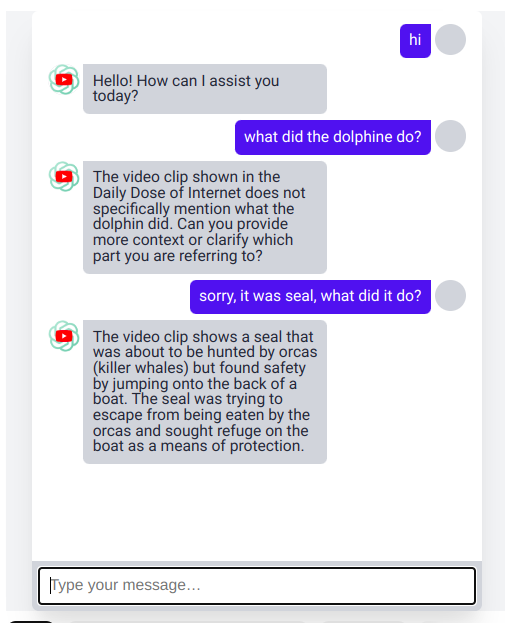

<div style="display:flex; flex-direction:column; width:100%">

</div>

# YTube GPT - Chrome Extension

This project introduces a Chrome extension enhancing YouTube video engagement. It enables real-time questions by utilizing video transcripts as context for ChatGPT. Responses are displayed in an embedded chat window with structured prompts for efficiency. The backend coordinates data exchange and response speed. Evaluation gauges user experience and learning impact, underscoring the extension's potential to transform passive video watching into an interactive, educational activity.

## Pre-requisites
- Open AI Account
- Google Chrome Browser

## Installation
### 1. Update Server Host:PORT
- Open `ytubegpt-extension/src/chatbot.js` and update line 1 to your server address
```js
const API_SERVER = "http://localhost:3000";
```
**Note:** Since you are hosting the server locally, make sure that the PORT is updated accordingly.

### 2. Install Extension
- Open Chrome and navigate to `chrome://extensions/`
- Enable `Developer Mode` in the top right corner
- Click `Load Unpacked` and select the `ytubegpt-extension` folder

### 3. Install Dependencies
- Open a terminal and navigate to the `ytubegpt-server` folder
- Run `yarn install` or `npm install`

### 4. Place OpenAI API Key
- navigate to the `ytubegpt-server` folder
- Create an `.env` file in the server root dir, and copy the variables from `.env.example`

- From your Open AI dashboard, copy the secret key and paste here.
```js
OPENAI_API_KEY=<YOUR-KEY-HERE>
```

### 5. Run the Server
- navigate to the `ytubegpt-server` folder
- Run `yarn start:dev` or `npm run start:dev`

### 6. Usage
- Go to your favorite YouTube video and click the extension icon
- Start asking questions and enjoy the responses!

## Screenshots


